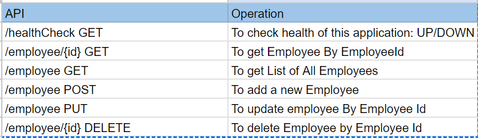

### Application monitoring using Grafana, Prometheus, Loki, Tempo, MIMIR
***
Build a springboot application using maven and java17
This application is basic CRUD opertaions for Employee

http://localhost:8080/healthCheck

### Swagger
***
http://localhost:8080/swagger-ui/index.html

## Prometheus

***
1. Prometheus is an open-source systems monitoring and alerting toolkit originally built at SoundCloud.

2. Prometheus collects and stores its metrics as time series data, i.e. metrics information is stored with the timestamp at which it was recorded, alongside optional key-value pairs called labels.

